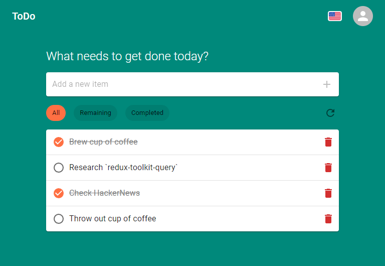

# Todo

> Sample React project to (re)learn Redux Toolkit Query, i18n, and Material UI.



## Development

1. Clone repository
2. Create `.env` from example
3. Start project with `npm run dev`

### Scripts

```sh
# Start project in development
npm run dev

# Run tests
npm test

# Build project for production
npm run build
```
